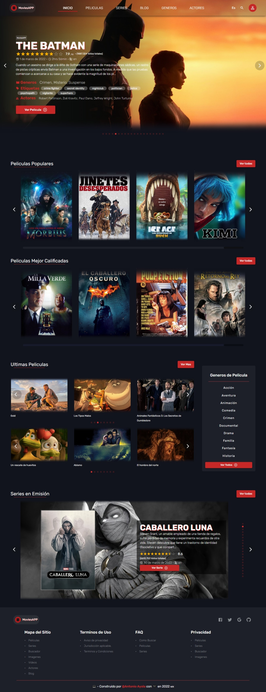
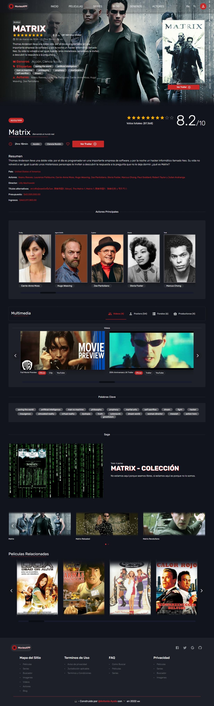
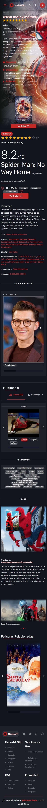

# **Movie APP**

Este proyecto es un sitio web para navegar entre peliculas y ver detalles de cada una.
Se ocupa la API de TheMovieDataBase [TMDV](https://www.themoviedb.org/) [API](https://developers.themoviedb.org/3/getting-started/introduction)

- Permite ver las peliculas mas populares, mejor calificadas, ultimos estrenos, por genero y peliculas actualmente en emisión.
- Permite ver detalles de cada pelicula (resumen, trailer, puntuación, duración, imagenes, reparto, videos, peliculas relacionadas...)
- Permite buscar peliculas por titulo, año y genero.

**_ Algun dia terminare la parte de series. _**

## **CAPTURAS**

<div>
    
    
    

</div>

<!--


-->

## **DEMO**

Puede ver el demo de este haciendo click [aquí](https://movies-app-tono2007.vercel.app/).

## **TECNOLOGIAS**

Para el proyecto utilice las siguientes tecnologias:

- ReactJs
- Material-ui(MUI)
- Swiper
- HTML, CSS,JS
- Vercel
- TMDB

## **USO**

Para usar este proyecto:

- Clonar repositorio: ` git clone https://github.com/Tono2007/Movies-App.git`
- Instalar dependencias: `npm install` o` yarn install`
- Ejecutarlo: `npm start` o ` yarn start`
- Obtén tu clave de la api TMDB [API](https://developers.themoviedb.org/3/getting-started/introduction)
- Configura variables de ambiente con tu clave

## Variables

Guiate del fichero **.env-example**
Para uso local crea `.env`

```ssh
REACT_APP_API_KEY_V3 = Key...
REACT_APP_API_KEY_V4 = Key...
```

## Ramas

Si este proyecto en algun momento crece.

- dev - > cualquier pull request a esta rama, por ahora no hay revisiones ni convenciones para la estructura, titulo y descripción de los cambios.
- main -> no modificar, esta se usara como un entorno de producción.
